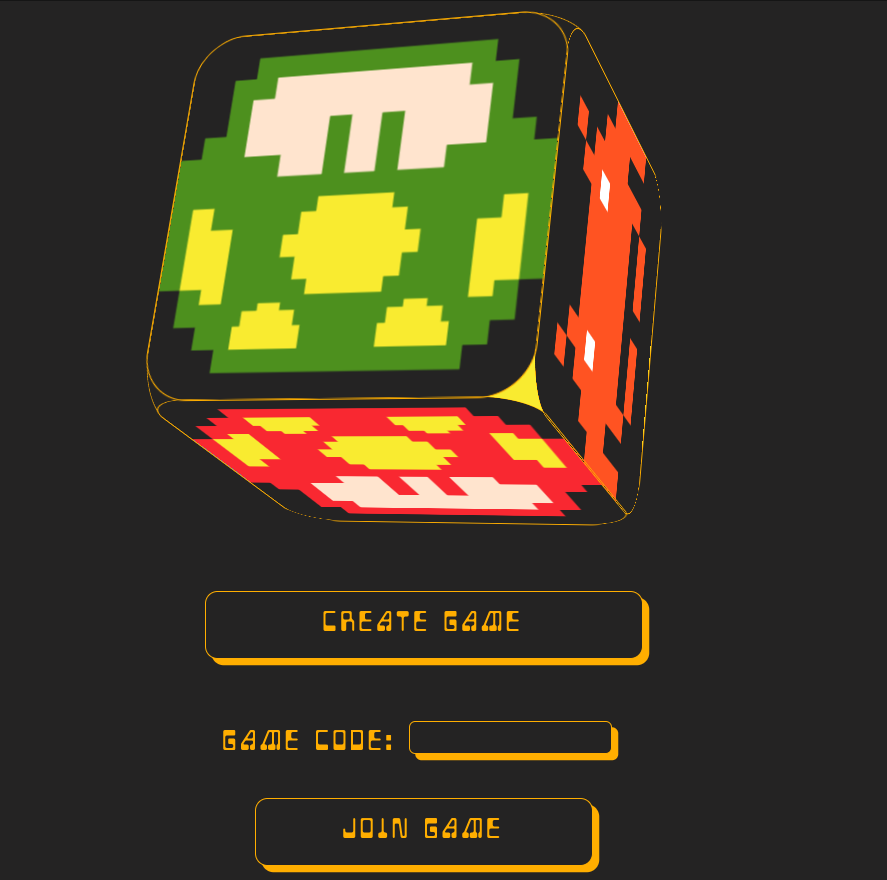
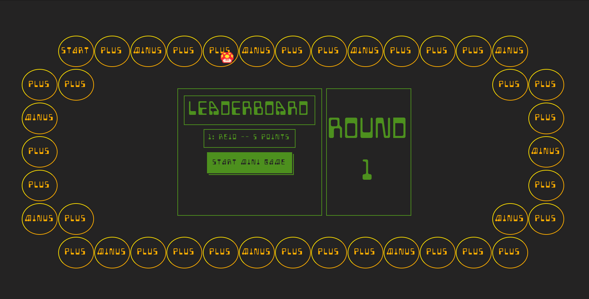

✨✨✨✨ Bootleg Party ✨✨✨✨

---

## Table of contents

- [Introduction](#introduction)
- [Installation](#installation)
- [Technologies](#technologies)
- [Features](#features)
- [Development_Team](#development_team)

---

## Introduction

Bootleg Party is a mulitplayer online experience that was inspired by the popular Nintendo game Mario Party, but with an added nostalgic twist. Our goal is to have our users have a familiar board game experience incorporated with mini-games that pay homage to some of our personal favorites. Bootleg party is best enjoyed with 4 players, and can be played with as few as 1, but ultimately, it’s all about having fun.

---

## Installation

If you want to check out the app for yourself, please visit https://bootleg-party.herokuapp.com.

If you want to install the app locally, feel free to fork this repo. Once downloaded, run npm install. You will need to create Firebase project at https://firebase.google.com and copy all config variables from the project's settings into a .env.local file that will accessed by src/firebase.js file. Note: all the of the environment variables must start with 'REACT_APP'.

---

## Technologies

- JavaScript
- React
- Phaser
- Firebase Realtime Database

## Features

- Play with up to 4 players simultaneously
- Play up to 25 rounds
- 4 unique mini-games

Upcoming Features:

- Added mini-games
- Alternate board selections
- Item shop
- Added Stars

---

## Development_Team

[Reid Van Wagner](www.linkedin.com/in/reid-vanwagner) | [Gabriel Gutierrez](https://www.linkedin.com/in/gg447062/) | [Robert Roldan](https://www.linkedin.com/in/robertroldan717) | [David Johnson](https://www.linkedin.com/in/david-johnson-3826a827/)
